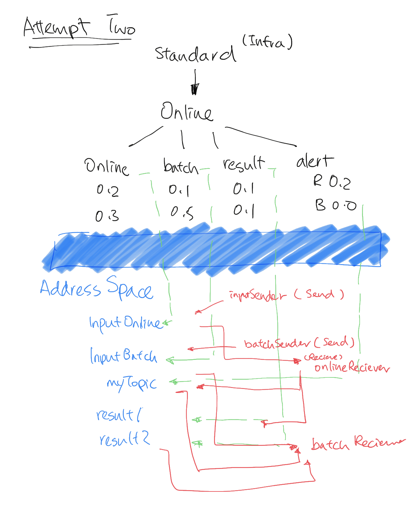

# AMQ Online Hackfest

## Overview

In this repo you will find four directories:

- **Client** 
Contains the applications sending and listening to/from the queues and topics.
- **Configmaps** 
Contains the configuration to create node anti affinity for QDR instances.
- **Plans** 
Contains the configuration plans for AMQ Online setups.
- **Tenants** 
Contains the configuration yaml files to setup AddressSpace and Address for each tenants. 


## Scenario 1

Hackfest Services wish to provide an online messaging interface to their customers.  They require the messaging service to be accessible over the internet, but wish to restrict access only to customers with a valid account.  

In the initial trial rollout of their service they are expecting to support around 100 customers,  growing to ~1000 customers within 3 months, and ~10000 within 12 months.

The Hackfest Services system works in the following way:

There are two input addresses `input_online` and `input_batch`.  Their customers send messages to one of these two addresses.  

Messages sent to `input_online` are generally small (<1KB in size) and each take at most 10 seconds to process.  Hackfest Services will run a number of identical processing applications which consume the messages sent to this address.  The results of processing will be sent back to a customer specific destination.  If the number of messages being sent to this address exceeds the rate at which they are being consumed, new consumers will be started.  Hackfest Services guarantees its customers that messages sent to this address will never be lost.  Individual customers will not be sending more than 50 msg/s during business hours (08:30 - 20:00 Eastern Time).  Hackfest Services makes no guarantees on messages sent to this address outside of these business hours (they may be discarded, or rejected, or processed).

Messages sent to `input_batch` are generally large (20KB - 1MB in size) and may take an hour or more to process.  Messages should only be sent to this address between 20:00 - 04:00 Eastern Time.  Each customer may send up to five such messages per day.

When onboarding a new customer, they should be provided with a set of credentials that is unique to them, and which has permissions only to send to the addresses `input_online` and `input_batch`, and the ability to consume from an address `results_<customer-id>` where _<customer-id>_ is a unique identifier for the customer.  Customers must process the results quickly enough to ensure that no more than 100 results messages are outstanding at any point on each result address.

Additionally there will be an address `alerts` which all customers can listen to. All clients listening to this address will receive the same messages while they are connected.  If a client is not connected it will not receive messages that are sent, even if the client later reconnects.  Customers may not send messages to the alerts address.

It is required that all connections from customers are made over TLS, and only the AMQP protocol will be made available.  The certificate provided by the messaging service must be valid.  Ideally the service should be made available on the defined IANA port for AMQP over TLS, i.e. 5671.

Hackfest Services requires that the system has 100% availability, and should be resilient against individual node failure within the cluster.
It is required that sufficient monitoring and alerting is set up such that the Hackfest Services team can detect issues with the service and take action


## Task:


Create the necessary AMQ Online addressspace plan(s), address plan(s), infrastructure templates, addresses, and scripts to meet the given requirements.  Create a PoC installation.  Verify that the performance/volume requirements can be met.  Consider if the change in usage pattern of the service during the day can be leveraged to optimise infrastructure usage.


## Solutions:

Setup AMQ Online: 

```
#login as system:admin

oc new-project amq-online-infra

oc apply -f bundles/amq-online/
oc apply -f prometheus/
oc apply -f grafana/
oc apply -f kube-state-metrics/
oc apply -f alertmanager/

```

Setup Plans: 

```
#login as system:admin

oc project amq-online-infra
oc apply -f ⁨plans⁩/⁨2nd-attemp⁩/
```

Configure for Tenant: 

```
#login as tenant user
oc login -u userX

oc project demo
oc apply -f ⁨tenants/⁨2nd-attemp⁩/

```




